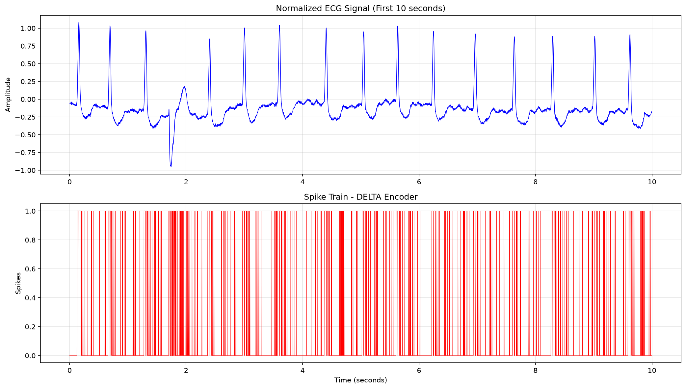
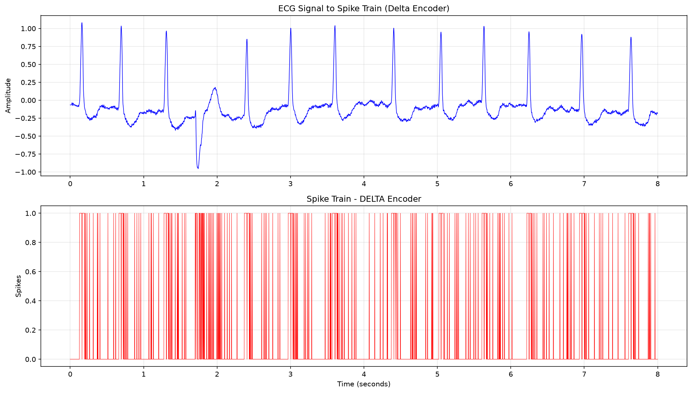

<div align="center">

<!-- HERO BANNER -->


<br/>

[](https://www.python.org/)
[](https://physionet.org/content/mitdb/1.0.0/)
[](LICENSE)
[](https://numpy.org/)
[](https://pandas.pydata.org/)
[](https://matplotlib.org/)

<br/>

```
  ███████╗ ██████╗ ██████╗     ███████╗██████╗ ██╗██╗  ██╗███████╗
  ██╔════╝██╔════╝██╔════╝     ██╔════╝██╔══██╗██║██║ ██╔╝██╔════╝
  █████╗  ██║     ██║  ███╗    ███████╗██████╔╝██║█████╔╝ █████╗
  ██╔══╝  ██║     ██║   ██║    ╚════██║██╔═══╝ ██║██╔═██╗ ██╔══╝
  ███████╗╚██████╗╚██████╔╝    ███████║██║     ██║██║  ██╗███████╗
  ╚══════╝ ╚═════╝ ╚═════╝     ╚══════╝╚═╝     ╚═╝╚═╝  ╚═╝╚══════╝
         ENCODING  ·  NEURAL  ·  ARRHYTHMIA  ·  DETECTION
```

<br/>

> *Converting raw cardiac signals into spike trains — the language of neuromorphic intelligence.*

<br/>

</div>

---

##  What Is This Project?

Traditional ECG analysis relies on deep learning models that demand massive compute. This project takes a **neuromorphic approach** — converting ECG signals into **spike trains** that mimic how biological neurons fire, enabling ultra-efficient arrhythmia detection on **Spiking Neural Networks (SNNs)**.

Three biologically-inspired encoders transform the continuous ECG waveform into discrete spike events:

<br/>

<div align="center">

|  | Encoder | Principle | Best For |
|:---:|:---|:---|:---|
|  | **Bens Spiker Algorithm (BSA)** | FIR filter + threshold crossing | Rate-coded SNN inputs |
|  | **Delta Modulation** | Temporal contrast (Δ up/down) | Dynamic waveform tracking |
|  | **Level Crossing** | Amplitude band boundaries | Sparse neuromorphic hardware |

</div>

<br/>

---

##  How ECG Becomes Spikes

```
Raw ECG Signal (MIT-BIH Record 210)
────────────────────────────────────────────────────────────
  ▁▂▃█▃▂▁    ▁▂▃█▃▂▁    ▁▂▃█▃▂▁    ← Cardiac cycles (MLII)

                    ↓  Spike Encoders

BSA Output:
  · · · ▌ · · ·    · · · ▌ · · ·   ← Spike on threshold cross

Delta Output:
  ↑ ↑ ↑ ↑ ↓ ↓ ↓    ↑ ↑ ↑ ↑ ↓ ↓   ← +1 rise / -1 fall

Level Crossing:
  · ▌ · · · ▌ ·    · ▌ · · · ▌ ·  ← Spike on band change
────────────────────────────────────────────────────────────
           Input to Spiking Neural Network (SNN) 
```

---

##  Real Output Visualizations

> Actual plots generated by running `ecg_spike_encoder.py` on MIT-BIH Record 210.

### Delta Encoder — Normalized ECG + Spike Train (First 10 seconds)

<div align="center">

</div>

*Top: Normalized ECG waveform showing clear R-peaks (QRS complexes) reaching amplitude ~4–5. Bottom: Delta encoder spike train — red ticks at y=1 mark upward signal changes, ticks at y=0 mark downward changes.*

<br/>

### Delta Encoder — ECG Signal → Spike Train (First 8 seconds)

<div align="center">

</div>

*Top: Normalized ECG with characteristic R-peaks at regular ~0.8s intervals. Bottom: Dense red spike train showing high firing rate during QRS complexes and quieter inter-beat intervals — the neuromorphic fingerprint of a heartbeat.*

<br/>

>  To add these images to your repo, create an `assets/` folder and place both PNG screenshots inside it, then `git add assets/ && git commit -m "Add output visualizations" && git push`.

---

##  Project Structure

```
ecg-spike-encoding/
│
├──  ecg_spike_encoder.py      ← Core encoder: BSA + Delta + Level Crossing
├──  convert_to_csv.py         ← WFDB → CSV converter for MIT-BIH records
├──  210.csv                   ← Sample ECG data (Record 210, ~30 min)
│
├──  outputs/
│   ├── 210_bsa_spikes.csv       ← BSA spike train
│   ├── 210_delta_spikes.csv     ← Delta Modulation spike train
│   └── 210_lc_spikes.csv        ← Level Crossing spike train
│
├──  requirements.txt
├──  .gitignore
├──  LICENSE
└──  README.md
```

---

##  Installation

```bash
# 1. Clone the repository
git clone https://github.com/Deshwan25boe10077/ECG-SPIKE-ENCODING.git
cd ECG-SPIKE-ENCODING

# 2. Install dependencies
pip install -r requirements.txt
```

**Dependencies:**
```
wfdb >= 4.1.0        # MIT-BIH database loader
numpy >= 1.24.0      # Signal processing
pandas >= 2.0.0      # Data handling
matplotlib >= 3.7.0  # Visualization
scipy >= 1.10.0      # FIR filter (BSA)
```

---

##  Usage

### Step 1 — Load ECG Data
```bash
python convert_to_csv.py
```
Downloads and converts MIT-BIH Record `210` → `210.csv`

### Step 2 — Run All Encoders
```bash
python ecg_spike_encoder.py
```
Produces three spike train CSV files in the `outputs/` folder.

---

##  Encoder Deep Dive

<details>
<summary><b> Bens Spiker Algorithm (BSA)</b></summary>
<br/>

BSA convolves the ECG signal with a FIR low-pass filter and compares the result against a threshold. A spike is emitted when the filtered signal exceeds the threshold at that sample.

```python
# Core BSA logic
filtered = np.convolve(ecg_signal, fir_filter, mode='same')
spikes = (filtered > threshold).astype(int)
```

- **Output:** Binary spike train (0 or 1 per sample)
- **Strength:** Preserves R-peak timing accurately
- **Use case:** Rate-coded SNN classifiers

</details>

<details>
<summary><b> Delta Modulation (Temporal Contrast)</b></summary>
<br/>

Delta Modulation tracks the running difference between consecutive samples. It emits a positive spike on increase, negative on decrease, and zero otherwise — capturing the morphology of the ECG waveform dynamically.

```python
# Core Delta logic
delta = np.diff(ecg_signal)
spikes = np.sign(delta)   # +1, -1, or 0
```

- **Output:** Ternary spike train (+1, -1, 0)
- **Strength:** Captures waveform shape changes (P, QRS, T waves)
- **Use case:** Temporal SNN models

</details>

<details>
<summary><b> Level Crossing Encoder</b></summary>
<br/>

The signal amplitude range is divided into fixed bands. A spike is emitted whenever the ECG signal crosses from one band to another — producing an extremely sparse, event-driven representation.

```python
# Core Level Crossing logic
bands = np.linspace(signal.min(), signal.max(), n_levels)
level_idx = np.digitize(ecg_signal, bands)
spikes = np.diff(level_idx)  # Non-zero = crossing event
```

- **Output:** Sparse event stream
- **Strength:** Minimal spikes — ideal for neuromorphic chips
- **Use case:** Intel Loihi, IBM TrueNorth hardware SNN

</details>

---

##  Dataset

<div align="center">

| Property | Value |
|:---|:---|
|  Source | [MIT-BIH Arrhythmia Database — PhysioNet](https://physionet.org/content/mitdb/1.0.0/) |
|  Record Used | `210` (normal + arrhythmic beats) |
|  Sampling Rate | 360 Hz |
|  Duration | ~30 minutes (650,000 samples) |
|  Channels | MLII, V1 |
|  Loader | `wfdb` Python library |

</div>

---

##  Future Work

- [ ] Train an SNN classifier on spike outputs using [snnTorch](https://github.com/jeshraghian/snntorch)
- [ ] Benchmark all three encoders on arrhythmia classification accuracy
- [ ] Add support for all 48 MIT-BIH records
- [ ] Deploy on neuromorphic hardware (Intel Loihi)
- [ ] Compare with conventional CNN-based ECG classifiers

---

##  Contact

<div align="center">

| Name | Role | Email |
|:---|:---|:---|
| **Deshwan TD** | Author | [deshwan.25boe10077@vitbhopal.ac.in](mailto:deshwan.25boe10077@vitbhopal.ac.in) |
| **Kowshik R** | Collaborator | [kowshik.25mim10158@vitbhopal.ac.in](mailto:kowshik.25mim10158@vitbhopal.ac.in) |

</div>

Feel free to reach out for questions, collaborations, or feedback on the project!

---

##  License

This project is licensed under the **MIT License** — see the [LICENSE](LICENSE) file for details.

---

##  Acknowledgements

- [PhysioNet](https://physionet.org/) — MIT-BIH Arrhythmia Database
- [WFDB Python Library](https://github.com/MIT-LCP/wfdb-python) — ECG data loading
- Neuromorphic computing research community

---

<div align="center">


**Made with hardwork for neuromorphic computing research**

⭐ *If this project helped you, consider giving it a star!* ⭐

</div>
